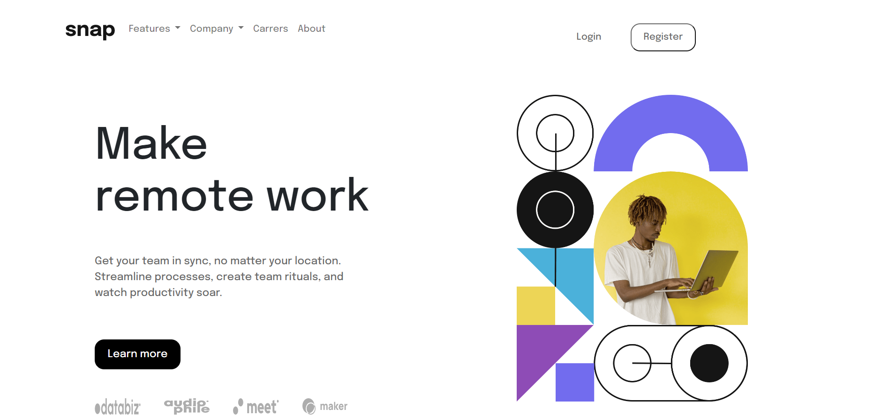

# Frontend Mentor - Intro section with dropdown navigation solution

## Table of contents

- [Overview](#overview)
  - [The challenge](#the-challenge)
  - [Screenshot](#screenshot)
  - [Links](#links)
- [My process](#my-process)
  - [Built with](#built-with)
  - [What I learned](#what-i-learned)
  - [Continued development](#continued-development)
  - [Useful resources](#useful-resources)
- [Author](#author)
- [Acknowledgments](#acknowledgments)


## Overview

### The challenge

Users should be able to:

- View the relevant dropdown menus on desktop and mobile when interacting with the navigation links
- View the optimal layout for the content depending on their device's screen size
- See hover states for all interactive elements on the page

### Screenshot



### Links

- [Live demo](https://gonzalo6282.github.io/snap/)

## My process

### Built with

Semantic HTML5 markup

- CSS custom properties
- Flexbox
- CSS Grid
- Mobile-first workflow
- [Bootstrap](https://getbootstrap.com/) - CSS framework
- [AWS](https://signin.aws.amazon.com/) - Cloud services

### What I learned

To see how you can add code snippets, see below:

```html
<h1>Some HTML code I'm proud of</h1>
<div class="row justify-content-between">
   <div class="col-md-5 order-2 order-md-1" id="left-col">
      <main class="main">
         <div class="text">
            <h1>Make<br>remote work</h1>
            <h2>Make remote work</h2>
            <p> Get your team in sync, no matter your location. Streamline processes,
               create team rituals, and watch productivity soar.</p>
            <button class="learn" id="learn">Learn more</button>
            <div class="logo">
               
               
               
               
            </div>
         </div>
   </div>
   <div class="col-md-5 order-1 order-md-2" id="right-col">
      
      
   </div>
</div>
```

```css
@media (max-width: 600px) {
  #hero {
    display: none;
  }

  #hero-mob {
    display: block;
    width: 90%;
    height: 90%;
    margin-left: 25px;
    margin-top: 0px;
    padding-top: 0px;
  }
}

@media (max-width: 600px) {
  .text h1 {
    display: none;
  }
  .text h2 {
    display: block;
  }
  .text p {
    margin-top: 0px;
  }
}
```

### Continued development

I want to continue focusing on React in my future projects. These are some of the concepts I am still not completely comfortable with, I really want to refine and perfect.

### Useful resources

- [Youtube](https://youtu.be/_MrShB9fh7U) - This helped me for create an animated custom hamburger icon for the navbar in bootstrap 5.
- [Youtube](https://youtu.be/rg7Fvvl3taU) - This is an amazing tutorial which helped me understand the CSS grid. I'd recommend it to anyone still learning this concept.

## Author

- Website - [Gonzalo](http://gpena.co.uk)
- Frontend Mentor - [@Gonzalo6282](https://www.frontendmentor.io/profile/yourusername)

## Acknowledgments

- Youtube - [Kevin Powell](https://www.youtube.com/kepowob)

I did get inspiration from Kevin Powell, he is a coding instructor in Youtube. I'd recommend it to anyone that is learning programing to check some of his videos.

